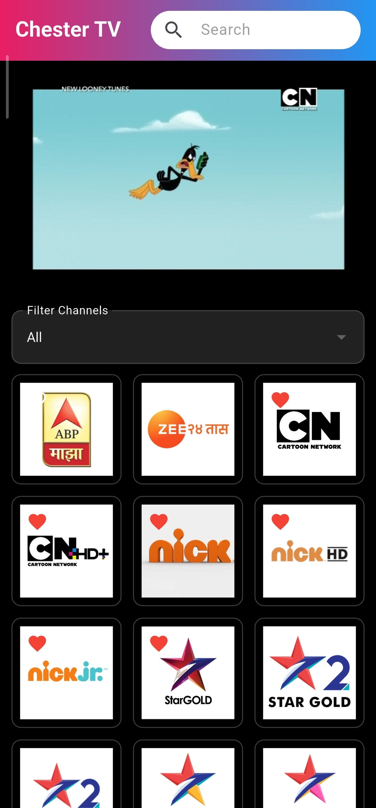
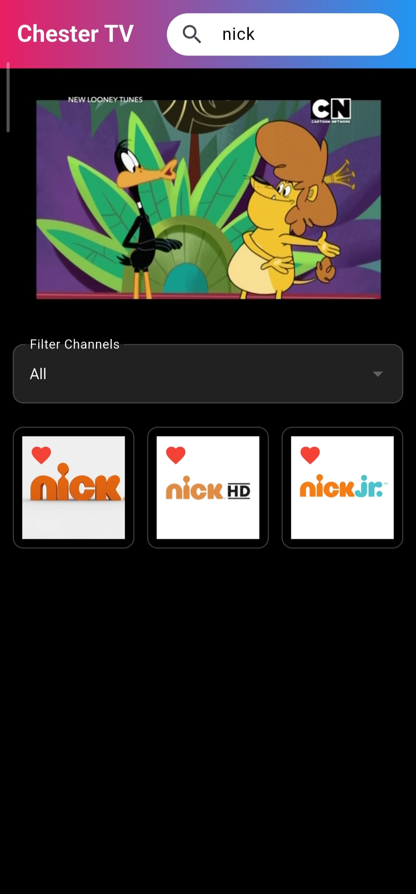
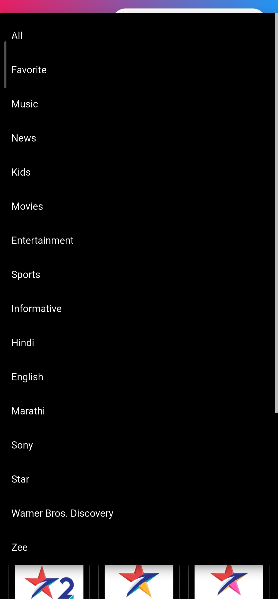
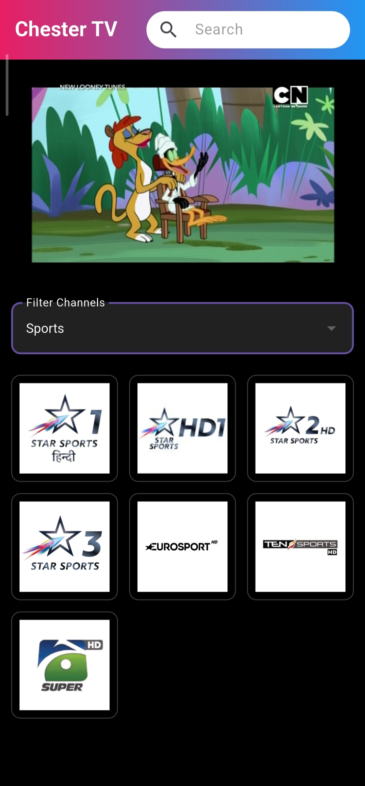

  

# 📺 Chester TV

  
  
  

  

A lightweight Live TV streaming application built with Flutter.

Chester TV brings together 64+ live TV channels across multiple categories including Entertainment, Movies, Sports, News, Music, Kids, and Informative content. The app is designed to make channel discovery simple with powerful filtering, search, and favorites support.

---

## ✨ Features

### 📡 Live TV Streaming

Watch live TV channels directly inside the app.

### ❤️ Favorites

Mark your favorite channels and access them quickly from the Favorites filter.

### 🔍 Smart Search

Search channels instantly by channel name.

### 🎯 Advanced Filters

Browse channels by:

* Category

  * Movies
  * Sports
  * News
  * Music
  * Kids
  * Entertainment
  * Informative

* Language

  * Hindi
  * English
  * Marathi

* Network / Brand

  * Sony
  * Star
  * Zee
  * Warner Bros. Discovery
  * Nick
  * Colors
  * Times Group
  * B4U
  * Epic
  * and more

---

## 📸 Screenshots

### App Home Screen

Shows the overall look and feel of Chester TV.

---

### Search Channels

Quickly find channels by typing their name.

---

### Filter Categories

View all available filter categories.

---

### Filtering Channels

Browse channels based on category, language, favorites, or network.

---

## 📺 Channel Collection

Chester TV currently supports 64+ live TV channels including both SD and HD streams.

Available content includes:

* Sports
* Movies
* Entertainment
* News
* Music
* Kids
* Educational & Informative Content

The channel collection is organized to make browsing easier through filters and search functionality.

---

## 🚀 Installation

1. Download the latest APK from the Releases section.
2. Install the APK on your Android device.
3. Launch Chester TV.
4. Start watching your favorite channels.

---

## 🛠 Built With

### Flutter

The application is developed using Flutter for cross-platform support and a smooth user experience.

### Media Kit

Used as the primary video playback engine for reliable live stream playback.

### Shared Preferences

Used for storing favorite channels locally on the device.

### JSON-Based Channel Database

Channel information is managed through a JSON structure for easier maintenance and updates.

---

## 🎯 Why Chester TV?

Many TV applications are cluttered with unnecessary menus and complicated navigation.

Chester TV focuses on simplicity:

* Fast channel access
* Easy search
* Clean interface
* Favorites support
* Organized filtering system
* Lightweight experience

---

## 📌 Project Status

Active Development

New channels, UI improvements, and additional features may be added in future updates.

---

## 📄 Disclaimer

This project is created for educational and personal development purposes. Channel streams are provided through publicly accessible sources. Rights to channel content belong to their respective owners.

---

### Developed by Atharva Meshram
